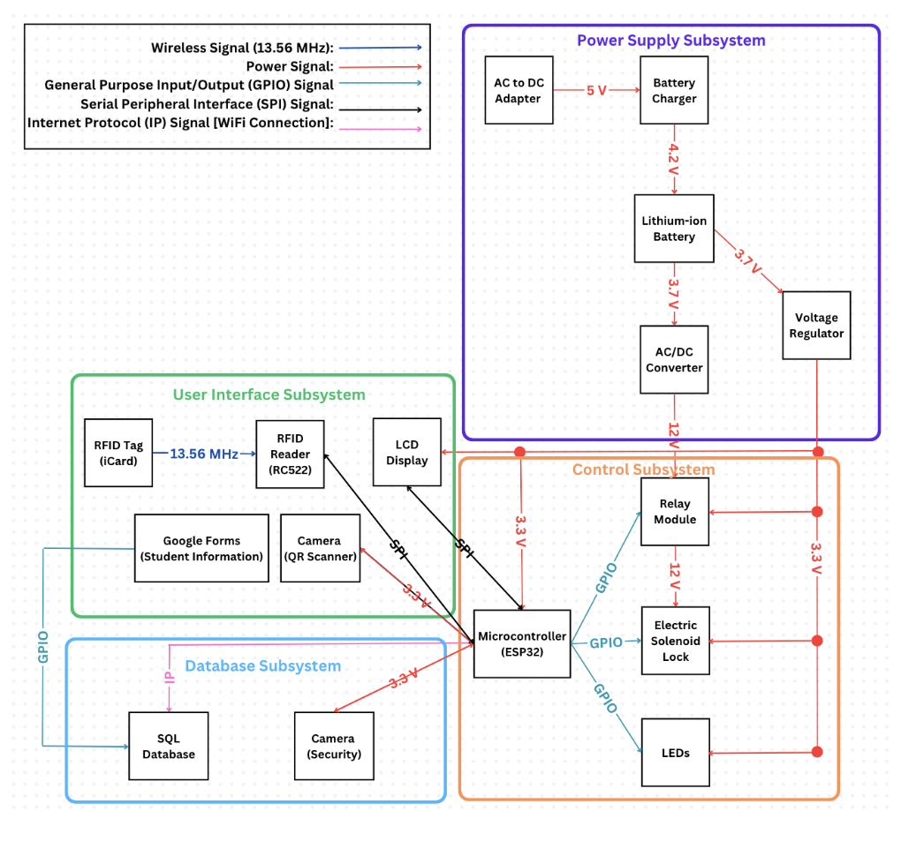
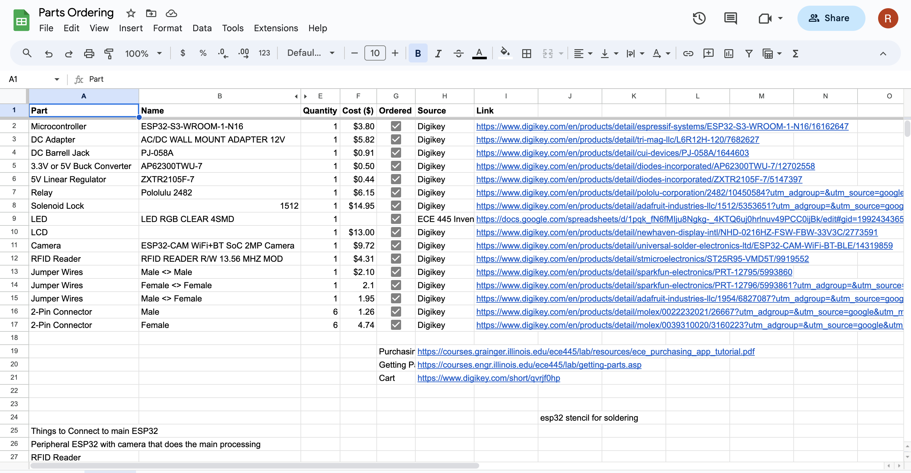
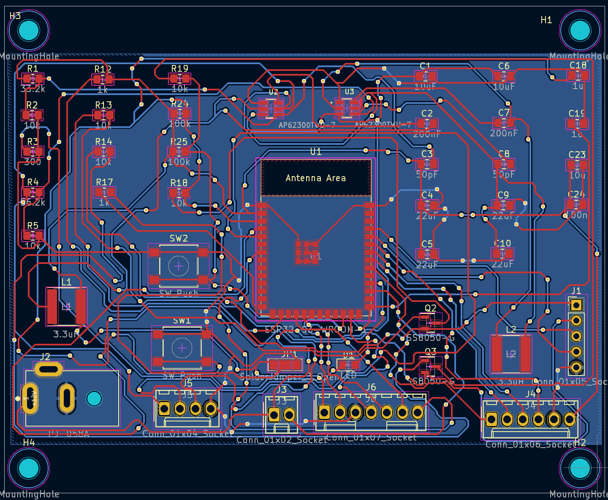
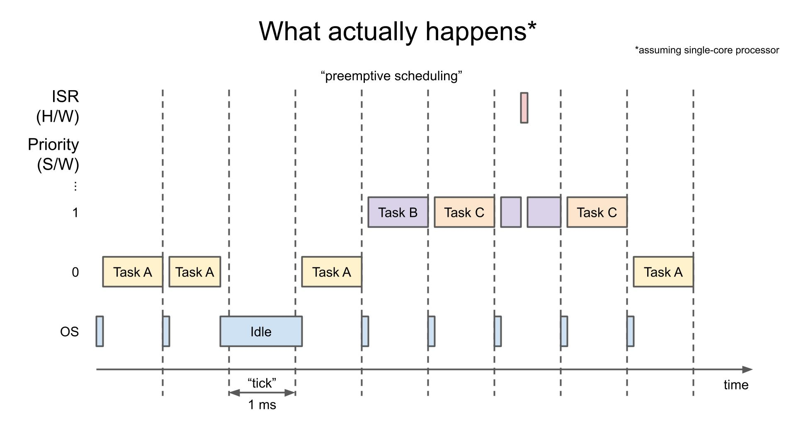
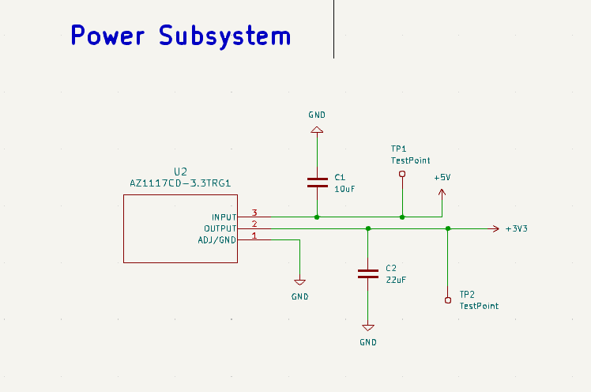
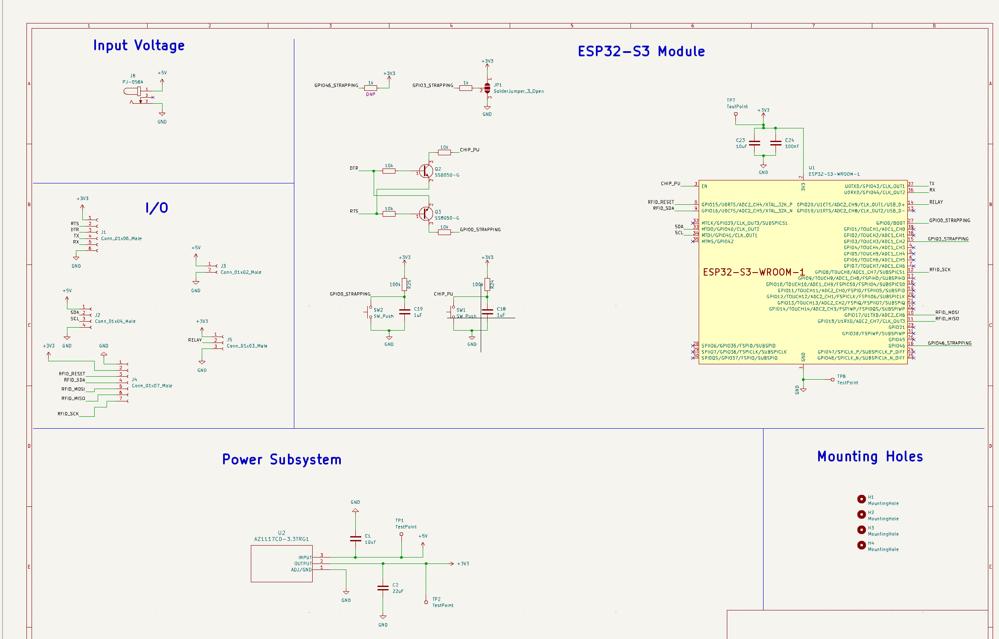
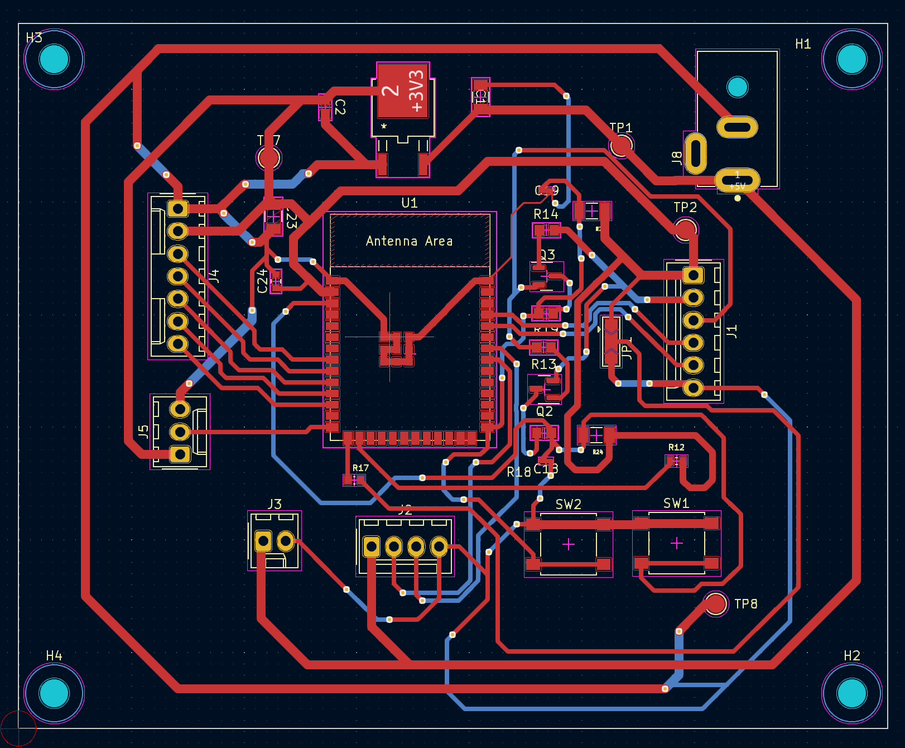
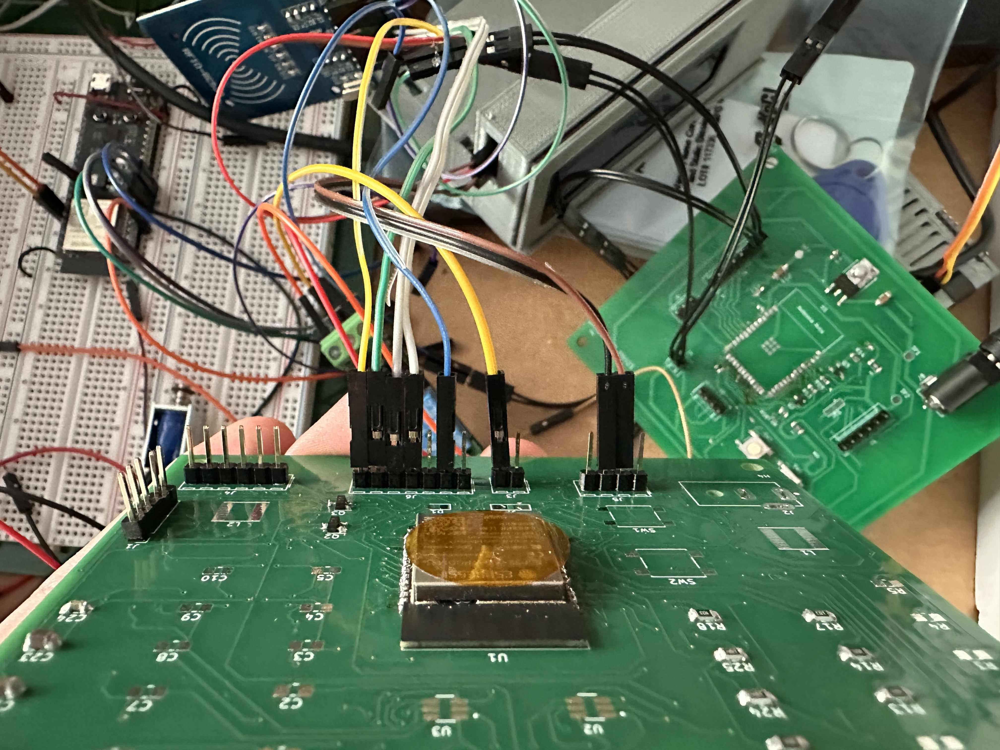

# Krish's Worklog & Journal

## 2023-09-05 - Discussing Projects

Our group met to discuss potential projects and since we couldn't come up with any ideas initially, we were looking strongly into the project pitches. We were particularly interest in the surgial light project and pen camera project with Professor Gruev and reached out to him to learn more about it. We also thought of backup ideas such as gesture controlled lights using gloves and garage control. Another idea that a TA pitched to us was a smart inventory system for components in ECE 445 and we are going to look more into this later.

## 2023-09-13 - Initial Project Proposal work

The group verified the idea for a smart system for ECE 445 components before working on the project proposal. We wanted to make sure that we incorporated a way to include a microcontroller into this system and that we can develop some level of complexity in to this project. We also were looking at some of the main elements of the current system such as security and logging and discussed different ways to streamline the processes before incorporating into our project. One aspect that we looked at for security was using RFID to allow access. We also looked at using a database to store transaction details.

## 2023-09-14 - Finalizing Team Contract and Project Proposal

Today, we all worked on the team contract to ensure that we established realistic standards for us to get our work done and make sure our project goes as smoothly as possible. We were transparent with the amount of work that we had to do this semester and wanted to make sure that we were all able to coordinate effectively to get the project completed on time. We also finalized our project proposal by choosing to take the RFID and database route. We outlined big picture goals for this project and wanted to ensure that these goals were realistic for this semester.

## 2023-09-27 - Worked on Design Doc

We spent a majority of our time coming up with the requirements and verifications needed for our system to be successful while also producing a tolerance analysis relating to the QR code detection component of the subsystem. There may need to be some tweaking to our R&V tables given that a lot of them used latency as a means of deciding success.

## 2023-09-28 - Finalized Design Doc

Today, we completed majority of the design document before the deadline. We generated a block diagram to display what the structure of the system would look like.



We created a tolerance analysis for the farthest possible distance the camera could be from the QR code to set a guideline for how far users should hold the QR codes when scanning. We also finalized our R&V tables for each subsystem with quanities that can be verifed to showcase the success of our subsystem. It was a little hard to showcase requirements for the database subsystem but we opted to simply show the functionality in terms of borrowing and returning the components. We also established a list of parts that we needed to begin our PCB work and Rohan started keeping a list of which parts we had ordered. Lastly, we all looked through our schedules and tried to create a realistic schedule for how our project should try to be completed throughout the semester. This was a little hard when discussing since we all had different schedules but eventually we came to a viable schedule for all of us.

## 2023-10-03 - Finalizing Parts and Order Tracking

We wanted to finalize the parts that we needed for the project today. After going through our design document, we realized that the components we listed on there would not work on the PCB that we needed to develop and had to find new components. Rohan identified the correct parts and made sure that they worked with the design that we had in mind. He also accounted for voltage requirements and other requirements on the datasheet for each component before ordering these parts. 



Another small thing we looked at was stepping 12V down to 5V and then down to 3.3V using buck converters. However, cascading these buck converters would result in a faulty circuit due to the reduced voltage regulation. Each converter has its own voltage loop and there would be less precise voltge regulation with the cascading implementation that we had in mind. We then opted to using two seperate buck converters where one stepped 12V down to 5V and the other stepped 12V down to 3.3V.

## 2023-10-10 - Missed First PCB deadline

We planned on getting our PCB in for the first round deadline and we realized that there were some issues with our layout which led us to miss the first deadline. I worked on the schematic earlier today and realized that we would rather ensure that the schematic and layout and optimal and functional rather than submitting a faulty on for production and later test that it didn't work. We are planning on submitting a viable PCB order by next week. 

## 2023-10-13 - Finalized Schematic 

Today, I finalized the schematic for our PCB with the two buck converters and worked with Rohan to get the layout of the circuit complete. We are now ready for the PCB deadline next week. 

## 2023-10-19 - Potential Error in PCB Design

After revisiting the PCB design before the next submission, I realized that there were two different connector holes connected together. I realized that this would cause issues because an input coming in from the connector would impact the voltage and connection to the other peripheral device for the other connector. Therefore, I had to redesign the layout of the circuit while maintaining the same schematic. 



With this new layout, we are ready for the next order of PCB. 

## 2023-11-07 - Research QR Code Identification

Today, we received a lot of our ordered components and I looked into implementing QR Code recognition on the ESP32-CAM module that we ordered. Part of my research was looking into FreeRTOS using this [tutorial](https://docs.espressif.com/projects/esp-idf/en/latest/esp32/api-reference/system/freertos.html) specifically for the ESP32. I also looked at this [tutorial](https://freertos.org/Documentation/161204_Mastering_the_FreeRTOS_Real_Time_Kernel-A_Hands-On_Tutorial_Guide.pdf) to look at priority scheduling in FreeRTOS and how we can essentially look at implementing a real-time interrupt based system for QR code recognition. As of right now, there are multiple tasks that run on specific cores and we want to be able to give priority solely to our tasks.



## 2023-11-08 - Running bare-metal code on the seperate core

After some research, I came across a FreeRTOS function which allows you to pin tasks to a specific core instead of generalizing tasks on core 1. I added this function to the code to ensure that all QR code decoding is performed on core 0 and isn't held susceptible to the scheduler.

```c
    // pin tasks to core 0 for real-time tasks
    xTaskCreatePinnedToCore(
    QRCodeReader,        /* Task function. */
    "QRCodeReader_Task", /* name of task. */
    10000,               /* Stack size of task */
    NULL,                /* parameter of the task */
    1,                   /* priority of the task */
    &QRCodeReader_Task,  /* Task handle to keep track of created task */
    0);                  /* pin task to core 0 */
```

## 2023-11-09 - Initializing ESP32-CAM Module

Before I could successfully program the ESP32-CAM, I had to be able to configure the GPIO pins correctly through the bare-metal code and then also follow a specific sequence to program the microcontroller module. In term sof the GPIO pins, I looked at the ESP32 documentation to find the the specific pins and what they correspond to in terms of functionality. 

```c
    #define PWDN_GPIO_NUM 32
    #define RESET_GPIO_NUM -1
    #define XCLK_GPIO_NUM 0
    #define SIOD_GPIO_NUM 26
    #define SIOC_GPIO_NUM 27

    #define Y9_GPIO_NUM 35
    #define Y8_GPIO_NUM 34
    #define Y7_GPIO_NUM 39
    #define Y6_GPIO_NUM 36
    #define Y5_GPIO_NUM 21
    #define Y4_GPIO_NUM 19
    #define Y3_GPIO_NUM 18
    #define Y2_GPIO_NUM 5
    #define VSYNC_GPIO_NUM 25
    #define HREF_GPIO_NUM 23
    #define PCLK_GPIO_NUM 22
```

```c
    Serial.println("Start configuring and initializing the camera...");
    camera_config_t config;
    config.ledc_channel = LEDC_CHANNEL_0;
    config.ledc_timer = LEDC_TIMER_0;
    config.pin_d0 = Y2_GPIO_NUM;
    config.pin_d1 = Y3_GPIO_NUM;
    config.pin_d2 = Y4_GPIO_NUM;
    config.pin_d3 = Y5_GPIO_NUM;
    config.pin_d4 = Y6_GPIO_NUM;
    config.pin_d5 = Y7_GPIO_NUM;
    config.pin_d6 = Y8_GPIO_NUM;
    config.pin_d7 = Y9_GPIO_NUM;
    config.pin_xclk = XCLK_GPIO_NUM;
    config.pin_pclk = PCLK_GPIO_NUM;
    config.pin_vsync = VSYNC_GPIO_NUM;
    config.pin_href = HREF_GPIO_NUM;
    config.pin_sscb_sda = SIOD_GPIO_NUM;
    config.pin_sscb_scl = SIOC_GPIO_NUM;
    config.pin_pwdn = PWDN_GPIO_NUM;
    config.pin_reset = RESET_GPIO_NUM;
    config.xclk_freq_hz = 10000000;
    config.pixel_format = PIXFORMAT_GRAYSCALE;
    config.frame_size = FRAMESIZE_QVGA;
    config.jpeg_quality = 15;
    config.fb_count = 1;
```

To program the ESP32-CAM, I had to utilize a USB to UART bridge where one end was connected to my laptop and the other end connected male connector pins for jumper cable usage. We connected the TX pin on the bridge to the RX pin on the microcontroller and the RX pin on the bridge to the TX pin on the microcontroller. We also connected 5V and ground from the bridge to the 5V and ground pins on the ESP32-CAM to power it properly. Finally, we had to connect GPIO to the EN pin to put in into flash mode. Once we successfully programmed the ESP32-CAM, we could remove the TX and RX connected and press the reset button on the module to run the uploaded code.


## 2023-11-10 - Implementing Quirc Library for QR Code Decoding

After doing more research, I came across a library which provides API's for decoding QR codes. I played around with the library and created object to see what potential function calls could be useful for us. 

```c
  while (1) {
    q = quirc_new();
    if (q == NULL) {
      Serial.print("can't create quirc object\r\n");
      continue;
    }
  }
```

## 2023-11-11 - Capturing Images from ESP32-CAM 

Today, I looked to actually capture the image using the camera on the module. I had a little difficulty initializing the camera and I realized that I wasn't clamping the flap down properly with the latch present on the module. After a couple more tries, I re-progammed my ESP32-CAM module and was able to see the camera initialized. Once I did this, I was able to succesfully capture images.

```c
    esp_err_t err = esp_camera_init(&config);
    if (err != ESP_OK) {
        Serial.printf("Camera init failed with error 0x%x", err);
        ESP.restart();
    }

    fb = esp_camera_fb_get();
    if (!fb) {
        Serial.println("Camera capture failed");
        continue;
    }
```

## 2023-11-12 - Attempting to decode the QR code from the captured image

I worked on using the Quirc library to decode the QR code from the captured image and experimented with the given functions. In this [tutorial](https://github.com/dlbeer/quirc), it is shown how we can use a memcpy from the image we captured to a Quirc object and once we have the object in a variable, we can extract attempt to extract the QR code and decode it as well. Unfortunately, despite this code, the decoding method is not working as expected and it not able to extract any QR code from the image.

```c
    while (1) {
    q = quirc_new();
    if (q == NULL) {
      Serial.print("can't create quirc object\r\n");
      continue;
    }

    fb = esp_camera_fb_get();
    if (!fb) {
      Serial.println("Camera capture failed");
      continue;
    }

    image = quirc_begin(q, NULL, NULL);
    memcpy(image, fb->buf, fb->len);
    quirc_end(q);

    Serial.println("Identifying...");

    int count = quirc_count(q);
    if (count > 0) {
      quirc_extract(q, 0, &code);
      err = quirc_decode(&code, &data);

      if (err) {
    
        QRCodeResult = "Decoding FAILED";
      } else {
        Serial.printf("Decoding successful:\n");
        dumpData(&data);

        packet.QRCodeResultString = String((const char *)data.payload);

        delay(5000);
      }
    }

    esp_camera_fb_return(fb);
    fb = NULL;
    image = NULL;
    quirc_destroy(q);
  }
```

## 2023-11-13 - Successfully decoded QR code

I eventually figured out how to decode QR code and it ended up being a one line change. Essentially, the issue was that the image had to be adjusted to match the Quirc object and once it is, the decoding worked. 

```c
    while (1) {
    q = quirc_new();
    if (q == NULL) {
      Serial.print("can't create quirc object\r\n");
      continue;
    }

    fb = esp_camera_fb_get();
    if (!fb) {
      Serial.println("Camera capture failed");
      continue;
    }

    quirc_resize(q, fb->width, fb->height);
    image = quirc_begin(q, NULL, NULL);
    memcpy(image, fb->buf, fb->len);
    quirc_end(q);

    Serial.println("Identifying...");

    int count = quirc_count(q);
    if (count > 0) {
      quirc_extract(q, 0, &code);
      err = quirc_decode(&code, &data);

      if (err) {
    
        QRCodeResult = "Decoding FAILED";
      } else {
        Serial.printf("Decoding successful:\n");
        dumpData(&data);

        packet.QRCodeResultString = String((const char *)data.payload);

        delay(5000);
      }
    }

    esp_camera_fb_return(fb);
    fb = NULL;
    image = NULL;
    quirc_destroy(q);
  }
```

## 2023-11-14 - Indirect Communication with other ESP32 Microcontroller (16)

Since I got the decoding working, I was looking for ways to send data over to the other ESP32 Microcontroller.

We explored using [ESPNOW](https://dronebotworkshop.com/esp-now/) to provide peer-to-peer communication. However, the main ESP32 receiving sent data roughly only one out of every 10 times. I also tried to create a customized SPI connection over hardware between the two but given the time constraints, we weren't able to implement it. 

Rohan suggested using the existing Firebase database to write a component name from the camera and read it from the main ESP. An example of this process can be seen in the software Rohan wrote below:

```c
void pushComponent(String component) {
  if (Firebase.isTokenExpired()){
    Firebase.refreshToken(&config);
    Serial.println("Refresh token");
  }

  FirebaseJson jsonData;
  jsonData.set("component", component);

  if (Firebase.ready()) {
    Firebase.updateNode(fbdo, "current", jsonData);
    Serial.println("updated firebase");
    return;
  }
} 
```

Given the database method, I had to set up Wifi connection on the ESP32-CAM to be able to run the push components function and wrote the function below. 

```c
WiFi.begin(ssid);
  WiFi.mode(WIFI_STA);
  while (WiFi.status() != WL_CONNECTED) {
    delay(500);
    Serial.print(".");
  }
  Serial.println("");
  Serial.println("WiFi connected");

  Serial.println(WiFi.macAddress());
```

I also had to add some initial Firebase initialization to be able to interface with the database that Rohan set up.

```c
    // instantiate firebase object
    FirebaseData fbdo;
    FirebaseAuth auth;
    FirebaseConfig config_firebase;

    // initialize database
    Serial.printf("Firebase Client v%s\n\n", FIREBASE_CLIENT_VERSION);
    config_firebase.database_url = DATABASE_URL;
    config_firebase.api_key = API_KEY;
    auth.user.email = USER_EMAIL;
    auth.user.password = USER_PASSWORD;

    config_firebase.token_status_callback = tokenStatusCallback;
    config_firebase.max_token_generation_retry = 5;

    Firebase.begin(&config_firebase, &auth);
    Firebase.reconnectNetwork(true);
    Firebase.setMaxRetry(fbdo, 3);
    Firebase.setMaxErrorQueue(fbdo, 30);
    Firebase.enableClassicRequest(fbdo, true);
    fbdo.setBSSLBufferSize(4096, 1024);
```

Lastly, I had to update the loop that I initially had to perform the decoding to then say that everytime a QR code was successfully decoded, we should update the database. The updated code is below.

```c
    while (1) {
    q = quirc_new();
    if (q == NULL) {
      Serial.print("can't create quirc object\r\n");
      continue;
    }

    fb = esp_camera_fb_get();
    if (!fb) {
      Serial.println("Camera capture failed");
      continue;
    }

    quirc_resize(q, fb->width, fb->height);
    image = quirc_begin(q, NULL, NULL);
    memcpy(image, fb->buf, fb->len);
    quirc_end(q);

    Serial.println("Identifying...");

    int count = quirc_count(q);
    if (count > 0) {
      quirc_extract(q, 0, &code);
      err = quirc_decode(&code, &data);

      if (err) {
        // Serial.println("Decoding FAILED");
        QRCodeResult = "Decoding FAILED";
      } else {
        Serial.printf("Decoding successful:\n");
        dumpData(&data);

        // Serial.printf("Const Char Payload: %s\n", (const char *)data.payload);

        packet.QRCodeResultString = String((const char *)data.payload);

        Serial.println("Part Identified: " + packet.QRCodeResultString);
        Serial.println("Updating Database!");

        pushComponent(packet.QRCodeResultString);

        delay(5000);
      }
    }

    esp_camera_fb_return(fb);
    fb = NULL;
    image = NULL;
    quirc_destroy(q);
  }
```

This implementation ended up working perfectly and we were able to successfully update the database with the decoded QR codes.

## 2023-11-15 - Completing Breadboard Implementation Mock Demo

Today, Rohan and I put together the full system with our multiple subsystem on a breadboard for the mock demo to show a functioning system. We have yet to do the PCB implementation but showcased the essential functionality of the system today. 


## 2023-11-16 - Soldering the PCB and Burning It After

Since we got the project working on the development board, we focused on getting the PCB soldered. We first gathered all the relevant resistors and capacitors and inductors and began soldering. Since none of us have a lot of experience with soldering, it took us some time to ensure that all the components were on properly and used the continuity test to ensure that the microcontroller was soldered on properly. Once we finished, the completed PCB worked, with a simple "hello, world!" program printing to the serial monitor. However, this only worked while powered through the bridge from our laptops. 

After plugging our PCB into the wall adapter and providing it with a 12V input, we felt the PCB heat up quickly and wanted to double check the voltage values. When doing so, I realized that we were getting voltage levels that we should not have been getting in many places. For example, we were getting 24V as an output of one of our buck converter circuits instead of 5V. In the end, we ended up burning our entire circuit and microcontroller. 

We made a plan to work on our project over Thanksgiving break and redesign the PCB with working power supply. We are planning to put in a rush order of a new PCB through JLC and parts from Digikey. As soon as we come back from Thanksgiving break, we can re-solder our entire PCB and ideally get the system working for the final demo. 

## 2023-11-22 - Redesigning the PCB Schematic and Layout

Today, I spent the whole day re-designing the PCB given the last failure. We decided to change the power input from 12V to 5V since we never needed 12V anyways and can only have to worry about stepping 5V down to 3.3V. After making this design decision, Rohan did the tolerance analysis to ensure that we could achieve our desired voltage. I also had to ensure that the widths of our tracks were big enough while also ensuring that the positioning of the elements in the linear regulator circuit were in the appropriate place. Rohan then placed the order for the new PCB along with new components that we may need.





## 2023-11-28 - Assembling the PCB after Thanksgiving Break before Final Demo

Today, Rohan and I worked on soldering the new PCB. Initially, Rohan was able to verify that the PCB was successfully dropping 5V to 3.3V and proved that our power subsystem was working. After hours of soldering everything else on the board, we tried programming our ESP32 but unfortunately, we were not able to do so. The serial monitor showed that we were stuck in boot mode and always waiting for a program to be downloaded. We then checked the voltages across the board and then realized that there was an error with the ground voltage. Instead of verifying that the ground voltage was 0 or sometimes negative on the oscilloscope, we were getting 0.5V to 1.5V. We think that we may have bridged a trace and then provide some additional power to ground when we shouldn't have.

Since it was pretty late at night, we just decided to use this new PCB as our power supply subsystem and the old one as our control subsystem with the microcontroller that was successfully programmed. We resoldered our old board with the ESP32 we had and the respective other components on that PCB and once we did so, we were able to connect the two board successfully and getting the project working as expected. 



You can see our final demo [here](https://youtu.be/PPzAGEirUPg?si=TuyA4h9PU0MN2_ne). We met all of our high level requirements were satisfied and our system was functional on our PCB at the end of this project.


