# Rohan's Worklog & Journal

## 2023-11-07

Today I spent the entire day on development since we've finally received many of the parts required for our user interface subsystem. My goal was to understand how to use the RFID reader module and LCD. To effectively learn how each of these parts worked before integrating them into the system, I first tested each module on my Arduino Uno using the manufacturer-provided test files and libraries. Once each of these was working individually, my objective for the day was to be able to read an RFID's unique ID (UID) using the Arduino and then echo it to the LCD. 

First, I found this [tutorial](https://learn.sunfounder.com/lesson-1-display-by-i2c-lcd1602/) on the SunFounder website to learn how to display text to the LCD. Similarly, I used this [guide](https://randomnerdtutorials.com/security-access-using-mfrc522-rfid-reader-with-arduino/) to setup & wire the RFID reader using my Arduino. Once those were setup, I was able to use the following code to get the RFID to print its UID to the serial monitor.

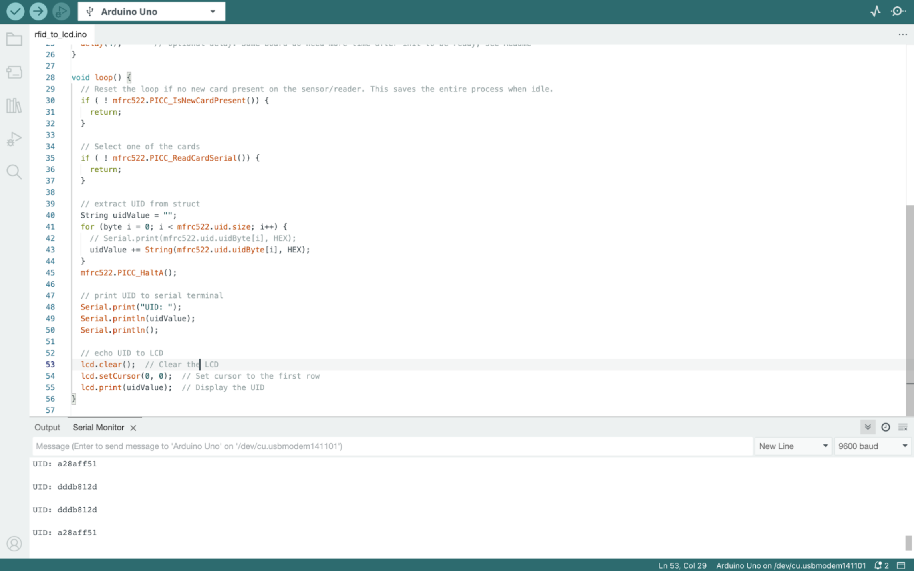

Our project initially proposed using iCards as the RFID tags to allow authentication into the system. However, I unfortuntely realized that the RFID reader we had ordered is not compatible with iCards, as only the provided test RFID tags were being read. I ended up looking into [types of RFID](https://www.atlasrfidstore.com/rfid-insider/low-frequency-rfid-vs-high-frequency-rfid/) and realized that there are two primary forms, high and low frequency readers and tags. The high frequency reader that we had ordered is more common in amateur or hobbyist settings, while low frequency ones are used in professional settings, like in iCards. However, buying a low frequency reader wouldn't be enough to solve this issue either - after some further investigation from this [forum](https://www.reddit.com/r/accesscontrol/comments/xr02mi/hid_seos_cards_returning_random_values_from_a/), I found that the iCard manufactuer, HID, restricts its cards to only be read by its HID brand. Even if I had a high frequency RFID reader, unless it was an HID one, the UID read from each iCard would be different each time as part of the company's encryption process. HID readers were all over $150, so I decided to talk to Sanjana and the course staff about the issue. 

By the end of the day, on the Arduino, I was able to get software running to extract the UID from an RFID tag and display that UID on the LCD, a significant component of our user interface subsystem. 

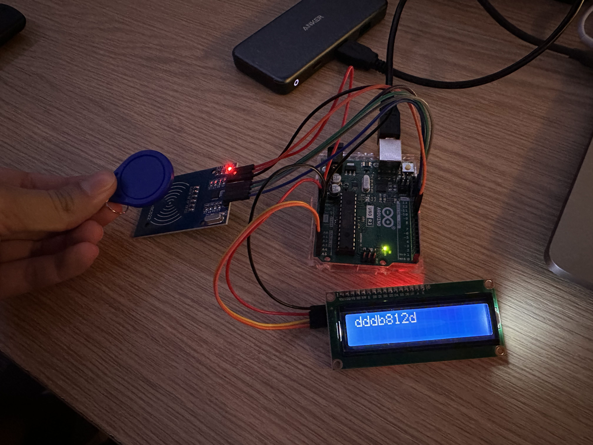

## 2023-11-08

Today my objective was to reproduce this system on the ESP32 Dev Board. Though this should be easy enough since all of the fundamental software is the same, I still had to read through the [Espressif documentation](https://docs.espressif.com/projects/esp-idf/en/latest/esp32s3/get-started/linux-macos-setup.html#get-started-linux-macos-first-steps) to understand how to flash the ESP32 with this code. Using this, I learned how to use the idf.py command line tool to flash a simple LED blinking program to the dev module, as shown here. 

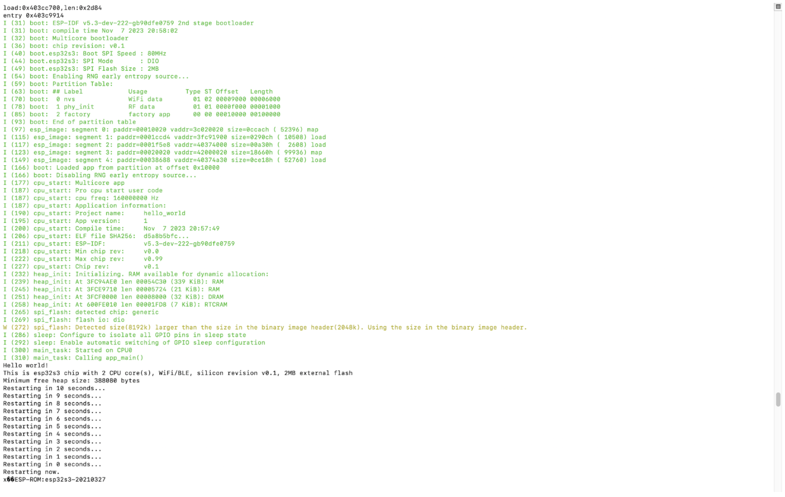

However, I initially had an issue flashing my Arduino code onto the dev module. I kept running into an issue where the dev module would say that it wasn't in download mode, and thus nothing could be flashed to it. I couldn't understand why this was the case, since flahsing the Espressif example programs had worked fine. After some searching, I found this [forum](http://community.heltec.cn/t/solved-wsl-v3-a-fatal-error-occurred-failed-to-connect-to-esp32-s3-wrong-boot-mode-detected-0x14/11962/6) which explained that if GPIO46 was set to a value, then the ESP would have undefined behavior. After finding the below diagram in the ESP32 datasheet, I moved one of my wires out of GPIO46, and then the module started working.

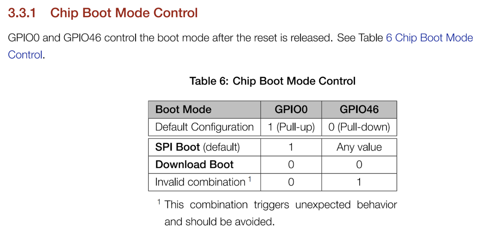

I realized that this was also why there is a DNP spot on the PCB schematic for GPIO46. Now the ESP dev module could run the same program as the Arduino.

## 2023-11-13

Today we received the relay module, so we tested it to ensure that we could use it in tandem with the solenoid lock and box. First, I tried to wire this so that the power input passes through the relay from the wall to the solenoid. However, the relay wasn't working as expected here. After some [research](https://www.circuitbasics.com/what-is-a-relay/) into the physics of relays, I realized that I had a conceptual misunderstanding into how relays worked. Rather than the power being passed through the relays, relays essentially have two different circuits, which are closed when activated by an electromagnet, allowing power to completely pass through. Using the following diagram, I was able to connect the relay in the correct way.

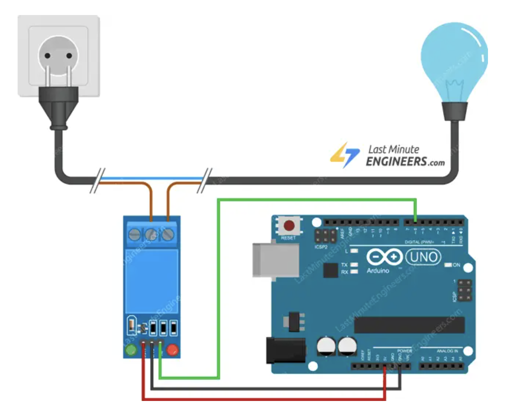

However, I still wasn't able to unlock the box with the relay. After even further investigation, I realized that the relay I had ordered was listed as a 12V relay. I initially thought this menat that it could power a 12V load. However, this dual-circuit electromagnet understanding made me realize that the 12V was actually the voltage required to enable the electromagnet. After connecting the enable pin to the 12V power source, the solenoid finally unlocked. This circuit is shown below.

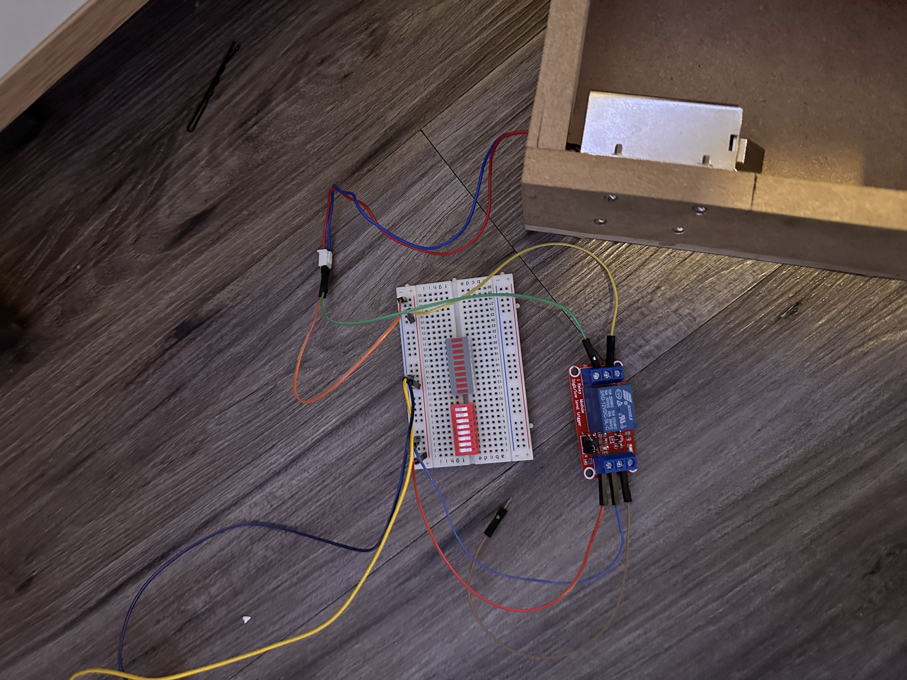

However, this was not the desired functionality, as the solenoid was supposed to be powered by a 3.3V enable input from the ESP32, since the ESP cannot send a 12V logic signal. Realizing this, I ordered a 3.3V relay for our system. 

## 2023-11-14

Today my objective was to set up the database subsystem for our project. I knew I wanted to use a serverless database because I wanted something easy to start without any infrastructure management required. However, there were a couple different options I explored, including MongoDB Atlas, AWS, and Google Firebase.

I ultimately landed on Google Firebase for a few reasons:
* Generous free tier
* Well-documented service for hosting serverless databases
* Offers schemaless, no-SQL database

Having a no-SQL database was also an important design consideration. Rather than a SQL database organized into rows and tables, Firebase's data is stored in documents, and ordered into collections. This allowed me a lot more freedom in designing the database and the main software for our project, since documents can store multiple different data types. Having this in a no-SQL format and viewed by a GUI on the Firebase web console also allows anyone to access the database, without requiring any technical knowledge or necessitating a SQL query. This is esential for our project, since it should be able to be used by any course staff in ECE 445 with a low barrier to entry. 

As an initial proof of concept, to just make sure that I understood how to push data into the database, I set up a sample program on the dev board to write the UID of an RFID tag to the database along with the time that it was read. The code and its output in the Firebase console can be seen here:

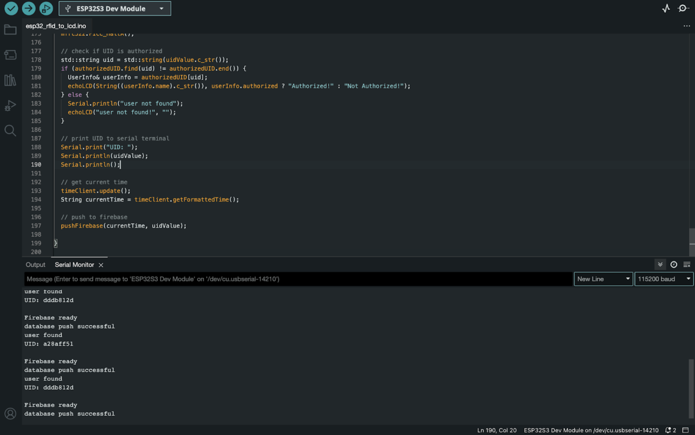

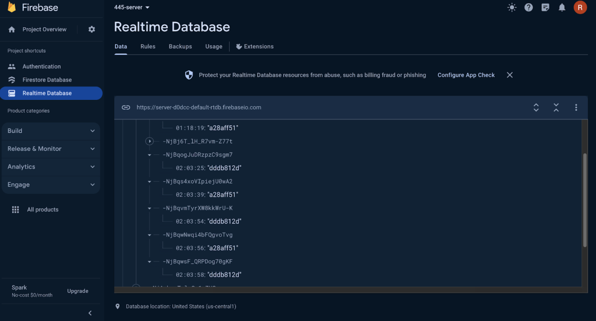

This [library](https://github.com/mobizt/Firebase-ESP32) was very useful in setting up Firebase authorizations. 

## 2023-11-15

Today I finished the software functionality to authorize users with RFIDs, display an unlock message to the LCD, unlock the box, and store these records in the databse. Though Krish was still working on getting the camera to decode QR codes, I wrote a Python script to mimic this process of sending components from the camera to the main system to see the entire user interface and database functionality at once. This was the major software component of the project, so there were a couple interesting design decisions involved here. The finalized software for this can also be seen [here](/src/main.ino).

Shown here is the finalized project built with the development board:

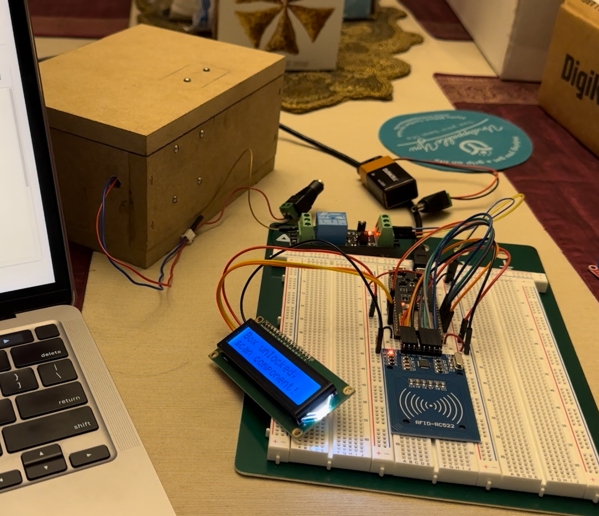

#### Polling-Based RFID Reading

The first step in the user interaction sequence is authorization through the RFID tag. At this point, since the system waits on an RFID tag to initiate, I had to decide between using polling- or interrupt- based IO. After having taken ECE391, I weighed the pros and cons of this decision, but ultimately decided on polling-based IO for a few reasons:

* Simplicity: Since the system wasn't doing any computation before the user interface sequence was initiated, there would be no process to be interrupted by the RFID tag, making an interrupt-based IO superfluous and overly complicated.
* Predictability: Since polling occurs at predefined intervals, it provides a predictable and consistent approach to checking the RFID reader's status, which is very beneficial given our real-time system. 

With a polling-based system, the loop repeatedly checks whether an RFID is present before initiating the rest of the sequence.

```c
echoLCD("Tap iCard!", "");
while (! mfrc522.PICC_IsNewCardPresent());
```

#### Database Design

I designed the database to maintain 3 types of collections:

* Checkouts: Lists all parts checked out, separated by user
* Inventory: Lists all parts in system, divided by whether they are in the container or outside of it
* Users: Lists all users, including whether they are authorized or not

The completed database looks like this:

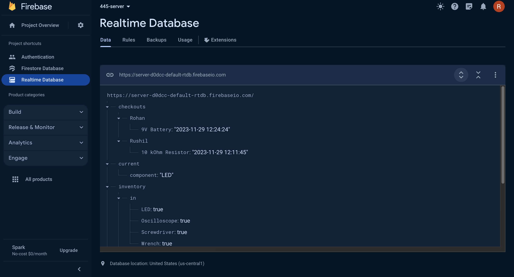

When storing these components in Firebase, I used a Firebase paradigm suggested in their [documentation](https://firebase.google.com/docs/database/cpp/structure-data) to invert the data as keys and set the values to either True, None, or some other (don't care) value. This makes checking whether a key is present a very easy process - I just have to try to access the value at /users/$uid/component (for example) to see if a user has checked out a certain component. If that access operation returns None, then I know the component is not present in that list. 

Though it seems like some duplicate information is stored (ie having both a checkouts and inventory list), for this data inversion paradigm to work, the keys need to be stored in multiple places within the database to encode multiple pieces of information. For example, to say that a screwdriver has both been checked out and is checked out to a certain user, it is easier to store this component both in the checkouts and inventory lists. 

An example of this paradigm can be seen here:

```py
def check_component(component):
    try:
        if db.reference(f'inventory/out/{component}').get():
            print("component present")
        else:
            print("component not present")
    except Exception as e:
        print("Database push failed")
        print(str(e))
```

I also created a [Python script](/src/firebase.py) to allow manipulation of the database by ECE 445 course staff. This includes things such as setting the inventory, authorizing users, or checking out components without requiring an RFID tap and QR code scan, in case the TAs need to manually make any adjustments. For example, course staff could use this script to set which users are authorized to access the component container:

```py
def set_users():
    try:

        data = {
            "authorized"  : {
                "Rohan" : True,
                "Rushil" : True,
            },
            "unauthorized" : {
                "Krish" : True,
            }
        }

        db.reference("users").set(data)
        print("success")
    except Exception as e:
        print("Database push failed")
        print(str(e))
```

#### Software Design to Create a Frictionless UX

When designing the software, I also took the time to think about the user experience and student journey as they go to check out components. Rather than forcing students to manually input whether they are checking out or returning components (specify the type of transaction), my database & software design automatically checks whether the component is in the inventory or has already been checked out, indicating whether the transaction is a borrow or a return, another advantage of having both *checkouts* and *inventory* lists. This allows students to seamlessly tap their iCard and scan the component's QR code, and the system will automatically update the database as a checkout or as a return. 

An excerpt of this process is shown here:

```c
if (Firebase.get(fbdo, "inventory/in/" + component)) {
    // component in box, so student borrowing
    Serial.println("Initiate borrow");

    // checkout entry {component : true}
    FirebaseJson checkoutData;
    checkoutData.set(component, currentTime);

    // inventory entry {component : true}
    FirebaseJson jsonData;
    jsonData.set(component, true);

    // update student checkout record
    Firebase.updateNode(fbdo, "checkouts/" + user, checkoutData);

    // remove part from in record
    Firebase.deleteNode(fbdo, "inventory/in/" + component);

    // add part to out record
    Firebase.updateNode(fbdo, "inventory/out", jsonData);

    echoLCD(component, "Checked out!");
}
```

In this software design, I also included protections for various edge cases, including a student trying to checkout or return a component that has already been checked out to another user. Since this sytem absolves the need for a TA to be present at every step of the checkout process, I wanted to ensure that the appropriate checks were still put into place. 

#### Dual-ESP Communication

Though Krish was still working through getting the camera to decode, we had talked through a couple different ways of communicating between the two ESPs. I was working on the software for the main ESP, while he was working on that for the camera ESP. Essentially, we needed a way of getting the camera ESP to send the decoded component's URL to the main ESP.

First, we explored using [ESPNOW](https://dronebotworkshop.com/esp-now/) to provide peer-to-peer communication between these two ESPs. However, after multiple iterations of testing, we found this process to be highly unreliable, with the main ESP receiving sent data roughly only one out of every 10 times. Krish also tried to create a customized SPI connection over hardware between the two, but this also proved to be far more challenging than he initially expected, so that idea also didn't work. 

Finally, I suggested using the existing Firebase database to write a component name from the camera and read it from the main ESP. This proved to be highly efficient, and made use of our existing database design, so I ended up including this in the finalized software. An example of this process can be seen in the software I wrote below:

```c
void pushComponent(String component) {
  if (Firebase.isTokenExpired()){
    Firebase.refreshToken(&config);
    Serial.println("Refresh token");
  }

  FirebaseJson jsonData;
  jsonData.set("component", component);

  if (Firebase.ready()) {
    Firebase.updateNode(fbdo, "current", jsonData);
    Serial.println("updated firebase");
    return;
  }
} 
```

## 2023-11-16

Now that the software is complete and the entire project is working on the development board, we needed to get the PCB soldered and working. Today, Krish and I spent 8 hours soldering parts onto our PCB to hopefully get it working with the overall system. At first, the completed PCB worked, with a simple "hello, world!" program printing to the serial monitor. However, this only worked while powered through the bridge from our laptops. 

Unfortunately, after plugging our PCB into the wall adapter and providing it with a 12V input, we realized that something was very wrong with our power supply subsystem. I went through and measured the voltages at each point using the oscilloscope in the lab, and realized that we were getting voltage levels that we should not have been getting in many places. For example, at the output of one of our buck converters, rather than getting 5V, we were getting 25V. Somehow, we had turned our buck converter into a boost converter, which ended up frying our entire circuit and microcontroller. 

Though we were understandably distraught, we made a plan to revitalize our project over Thanksgiving break. Though we would both be in different states for the holidays, we planned to put in a rush order of a new PCB JLC and parts from Digikey, so that as soon as Thanksgiving break was over, we could re-solder our entire PCB and hope that we could get it working by that Wednesday's demo. 

## 2023-11-22

Today, Krish and I spent the entire day re-designing our PCB on KiCAD. Krish had a few ideas on why our power subsystem failed, but we just decided to redesign it altogether. Rather than providing our circuit with 12V input and stepping it down twice to 5V and to 3.3V, we decided to instead provide a 5V input via the AC-DC adapter and then use a linear regulator circuit to step it down to 3.3V. Both Krish and I felt far more confident in our understanding of the linear regulator circuit, and hoped that this could solve our power subsystem problem. 

Now that we had selected a linear regulator, while Krish redesigned the PCB, I ran a tolerance analysis on our selected component. I used both the regulator's [datasheet](https://www.diodes.com/assets/Datasheets/AZ1117C.pdf) and the example tolerance analysis given in the [wiki](https://courses.engr.illinois.edu/ece445/wiki/#/regulators/index) to do this. Using this calculation:

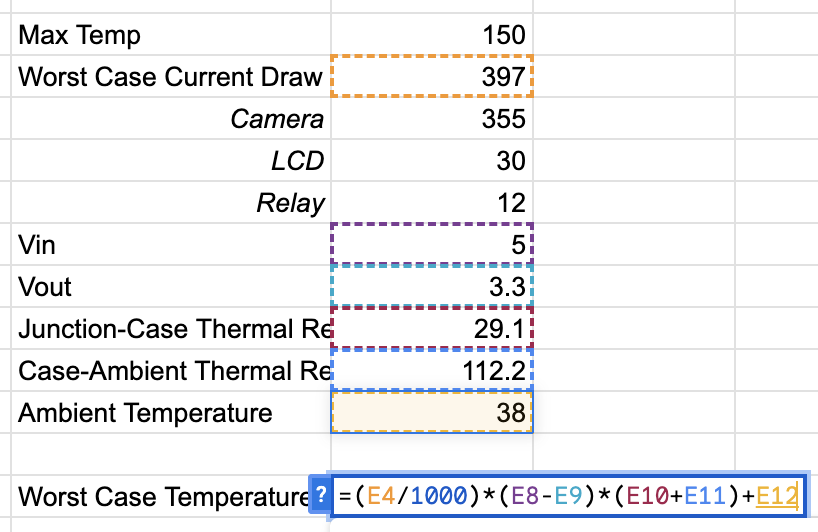

The maximum temperature the regulator would reach was 133 degrees Celsius in the worst case, which is lower than maximum temperature tolerance of 150 degrees Celsius.  

Once Krish finished designing the PCB and I finished wiring it, I placed an order on Digikey to get the new parts needed (mainly the new regulator and other ancillary resistors/capacitors) and an order on JLC PCB to get a rush shipment of the new PCB design. Both said that they would arrive by either the Monday or Tuesday after break. 

## 2023-11-27

Today my objective was to 3D print an enclosure for our PCB and the other various modules of our design. I followed some of the [tutorials](https://www.tinkercad.com/learn) on the Tinkercad website, a 3D printing software used by beginners, to create an enclosure for our PCB, the LCD, RFID reader, and camera. The source files can be [here](/3D_printing/). 

I then went to the Jackson Innovation Lab in the Mechanical Engineering building to learn how to 3D print my design. The volunteers there helped me understand how to use slicing software to optimize the build time of the design and generate supports for the print. 

The design in the slicing software can be seen here:

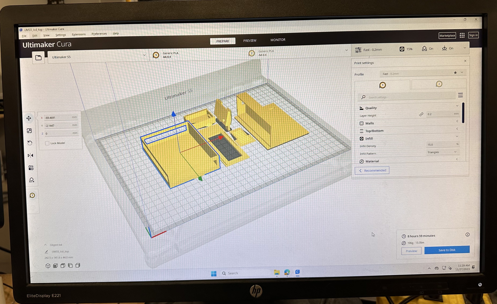

Here's the design as it's being printed:

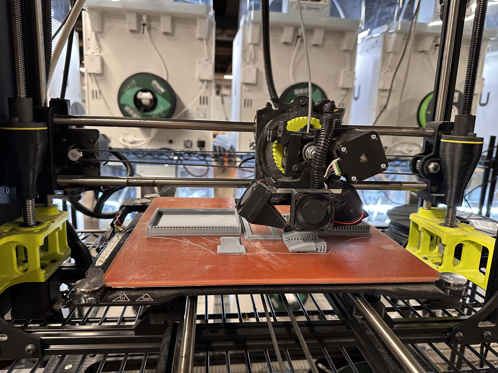

The finalized design of the main enclosure, with the LCD on top and the PCB hidden underneath:

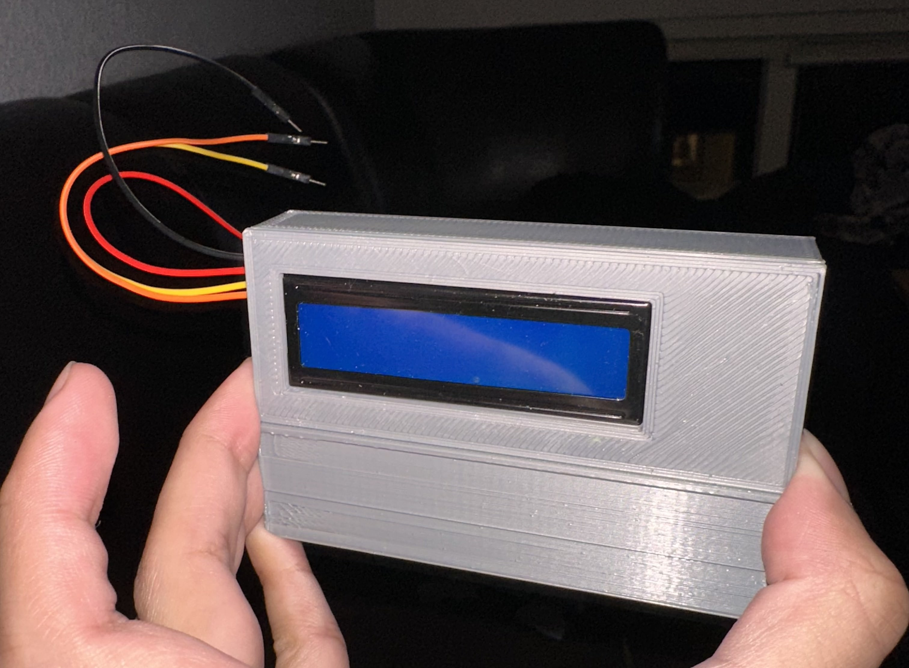


## 2023-11-28

Today, all of our parts as well as the updated PCB came in. I first soldered on the components to create the power subsystem to make sure that it worked, since that was the main issue in our last PCB. After inputting 5V from the AC-DC adapter, I was able to read 3.3V coming out of the linear regulator at the testpoint, indicating that the power subsystem was working on this new PCB.

The oscilloscope values values read are shown here:

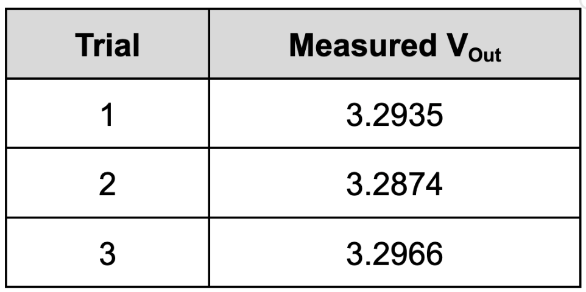
