# Rushil’s Lab Notebook

## 2023-09-05

Our objective was to decide on a project. We were discussing the project pitches and potential project ideas. We had emailed Professor Viktor Gruev about doing the pen camera for cancer detection and surgical light project, but we were still waiting on a response. Therefore, we decided to think of original ideas as a backup in case we hear no response at all. Some ideas we had included operating a garage door through a mobile phone via a magnetic switch sensor and gesture controlled lights. However, later today, a TA had suggested an idea for a smart inventory system for ECE 445 components as their current method is pretty outdated. It seemed to be a unique solution so we decided to go through with this idea since we also thought it would more likely be approved.

## 2023-09-12

Our objective was to begin designing our project, so I created the first draft of the high-level block diagram for our smart inventory system. Our design was an automated system that manages inventory using cameras and QR codes. This system stores components with QR codes in a locked container. Students scan their ID cards to unlock the container and access the components. They then select the parts they need and hold them up to a camera, which reads the QR codes and records which student took which components in a database. This camera is connected to a microcontroller that stores the data. Another camera acts as a security measure, recording footage to prevent theft and identify individuals involved in any such incidents. The same process is used for returning components: students scan their IDs to unlock the container and then rescan the components to indicate they are returning them.

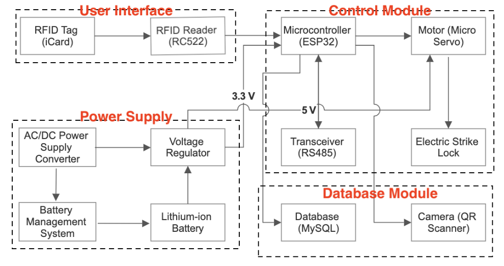

## 2023-09-13

Our objective was to go to the machine shop and discuss the details for our project. We just needed the machine shop to create a small box as our project did not require much mechanical design. I met with Gregg Bennett at the machine shop, and after some discussion, I realized that he wanted some more information about the box, not just the dimensions, in order to be sure about the design. For instance, we wanted us to provide the specific strike lock we want and to bring the components that we want to put in the box. He even offered to put enclosure boxes to make the battery and wires look clean and mount the LED/LCD screen. I then kept this information in mind and shared it with the rest of the group.

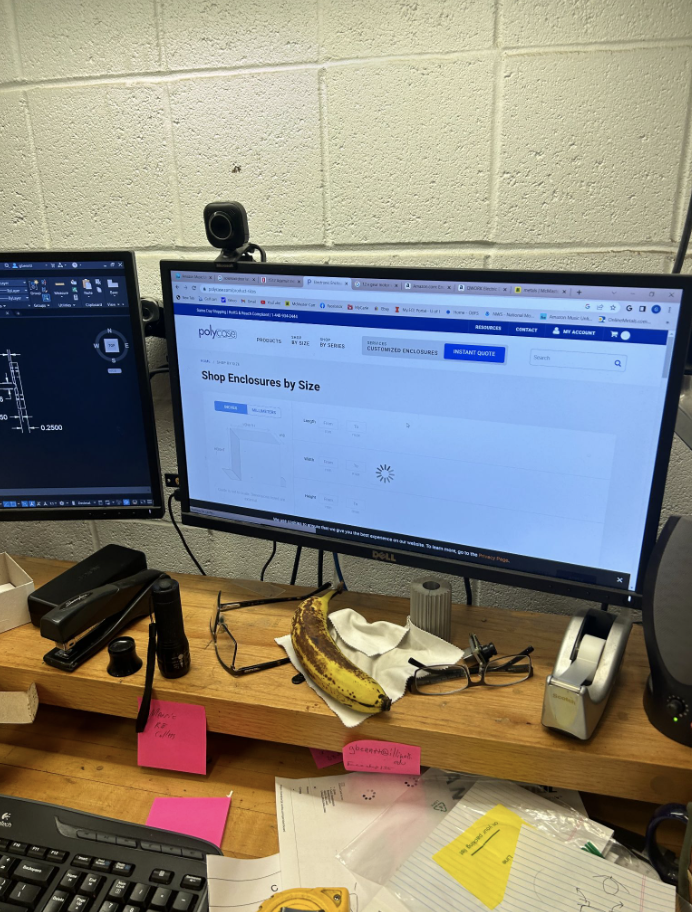

## 2023-09-14

Our objective was to complete the project proposal. I worked on the second draft of the block diagram, subsystem overview and requirements, and tolerance analysis for the project proposal. To ensure a smooth and secure experience for students using the inventory system, the user interface needs to be highly accurate (95%) and responsive (1 second response time), opening the container reliably after successful authentication (99%). The control subsystem must function flawlessly with a fast-locking electric strike (2 seconds), error-free QR code scanning (0.5% error rate), and remote opening capability within 5 seconds after iCard authentication. The ESP32 microcontroller needs to maintain a 99% uptime for reliable operation. Both cameras must capture clear and high-definition video for accurate scanning and security purposes. The database subsystem must generate error-free and comprehensive reports for TAs, continuously capture clear security footage (15 fps minimum), and have robust daily data backups to prevent any data loss. Finally, the power supply subsystem needs to ensure uninterrupted operation for at least 24 hours, maintain stable battery voltage (3.2V-4.2V), offer rapid recharging (4 hours maximum), and prioritize energy efficiency (90% conversion minimum).

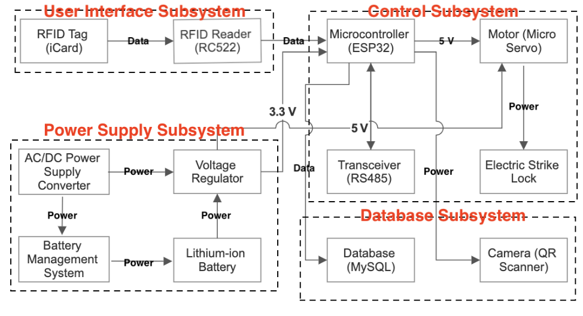

## 2023-09-18

Our objectives were to review the project proposal and identify the key components of our automated system, and brainstorm solutions for RFID card authentication and component tracking. We began working on the physical project. We started by carefully reviewing the project proposal to gain a clear understanding of its goals and objectives. We identified the main components of the system, including the ESP32 microcontroller, RFID reader, camera, LCD display, and database. Next, we engaged in a brainstorming session to explore potential solutions for RFID card authentication and component tracking. We considered various options, including using QR codes on components and implementing a user interface on the LCD display. After discussing the pros and cons of each solution, we decided to focus on developing a system that utilizes QR codes for identification and provides user feedback through the LCD screen.

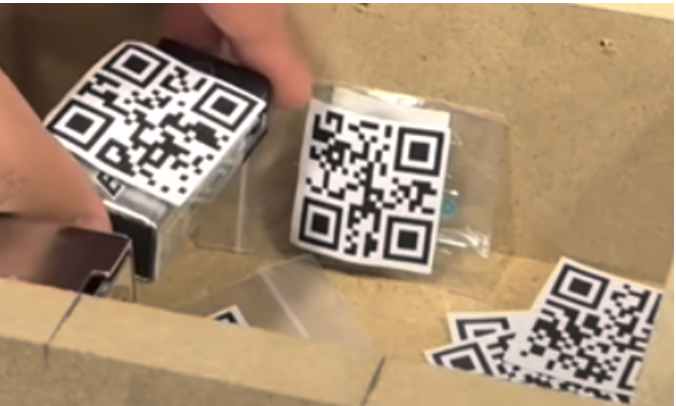

## 2023-09-20

Our objective was to develop detailed circuit diagrams for the control and power supply subsystems. These diagrams mapped out the connections between the various components and the flow of electricity. Selecting the appropriate power supply was crucial to ensure stable operation and avoid potential overheating issues. After careful analysis, we opted for a 12V linear regulator which was compatible with the chosen microcontroller. While laying the groundwork for the hardware, we continued exploring the software side of the project. We researched and evaluated various software platforms for user interface development. We considered features like screen size, display information, and user interaction methods. In addition, we explored cloud-based database solutions like Firebase and AWS IoT Core for data storage and management. 

## 2023-09-23

Our objectives were to research and compare different RFID reader modules to find the best fit for our project, and select suitable components for the camera module. We continued working on the project by researching various RFID reader modules available in the market. We compared their specifications, compatibility with the ESP32 microcontroller, and prices to determine the most suitable option for our system. After careful consideration, we decided to use the MFRC522 RFID reader due to its compatibility, ease of use, and affordability. We also focused on selecting the appropriate components for the camera module. We considered factors such as resolution, frame rate, field of view, and power consumption to ensure we chose a camera capable of capturing clear images and QR codes accurately. Ultimately, we opted for the OV7670 camera module, which offers a good balance of performance and cost-effectiveness.

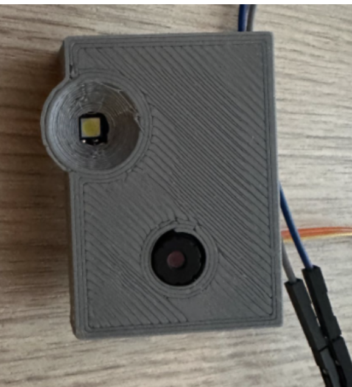

## 2023-09-25

Our objective was to design a PCB layout that is compact and easy to assemble. We made significant progress on the control subsystem by developing the schematic diagram, and we mapped out the connections between the ESP32 microcontroller, RFID reader, camera module, LCD display, power supply, and other components. In addition, we began designing the PCB layout using KiCad. We carefully placed each component on the virtual board, considering factors like size, spacing, and signal routing. 

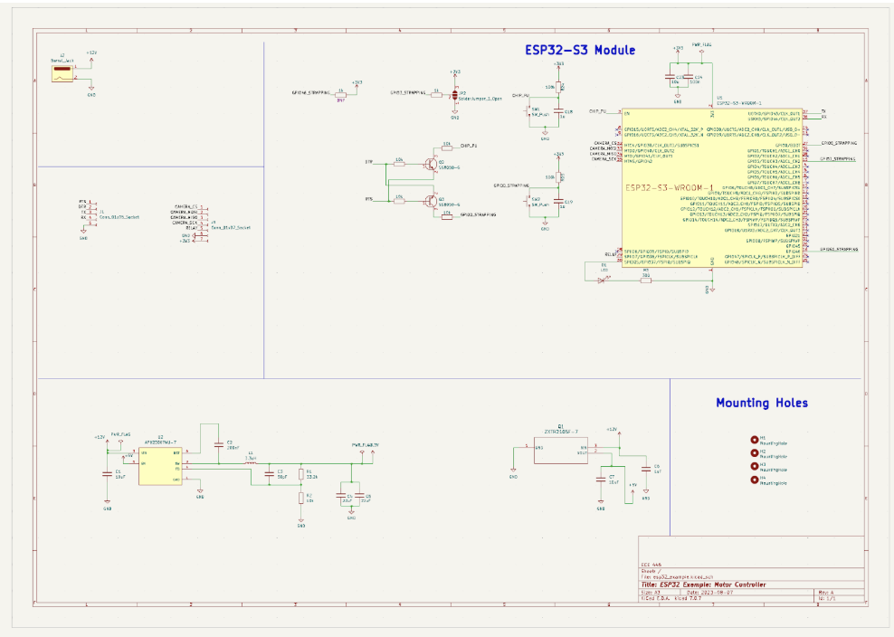

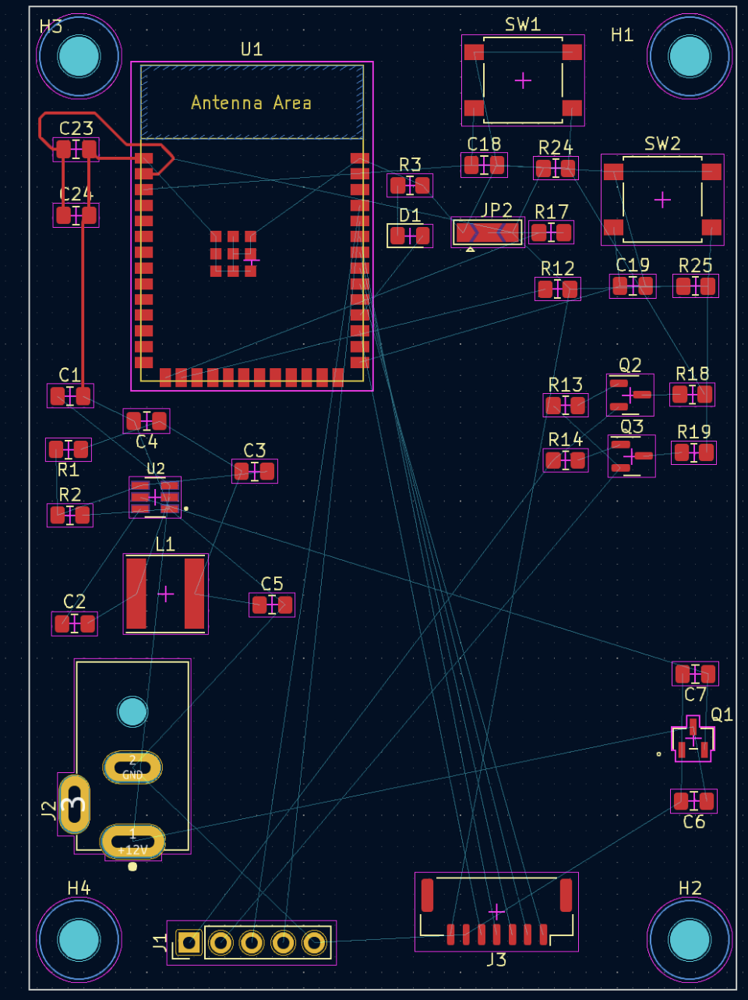

## 2023-09-28

Our objective was to complete the design document. I worked on the third draft of the block diagram, subsystem descriptions, subsystem requirements, subsystem verification, and costs of components. For instance, the system needs a strong and reliable relay board that can handle up to 5A ± 0.5A of power to control the container access. The electric lock on the container should open quickly (under 3 seconds) and last for many uses (at least 200 lock/unlock cycles). LED lights, green for unlocked and red for locked, will inform users of the container's status. In addition, The AC/DC adapter should convert 120 V from the wall outlet to 5 ± 1 V.

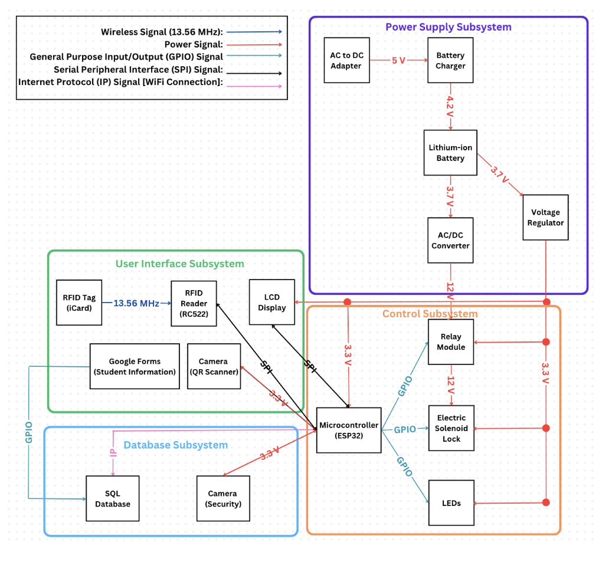

## 2023-10-04

Our objective was to focus on creating a user-friendly and intuitive experience. Our software development efforts focused on enabling component identification and display. We used a Python script to implement QR code scanning functionality via the ESP32 camera module. This process involved writing code to interpret the QR codes and display the corresponding component information on the LCD screen. In addition, we investigated secure data storage options and user authentication protocols, and studied RFID tags and PINs as potential authentication methods to restrict unauthorized access to the system.

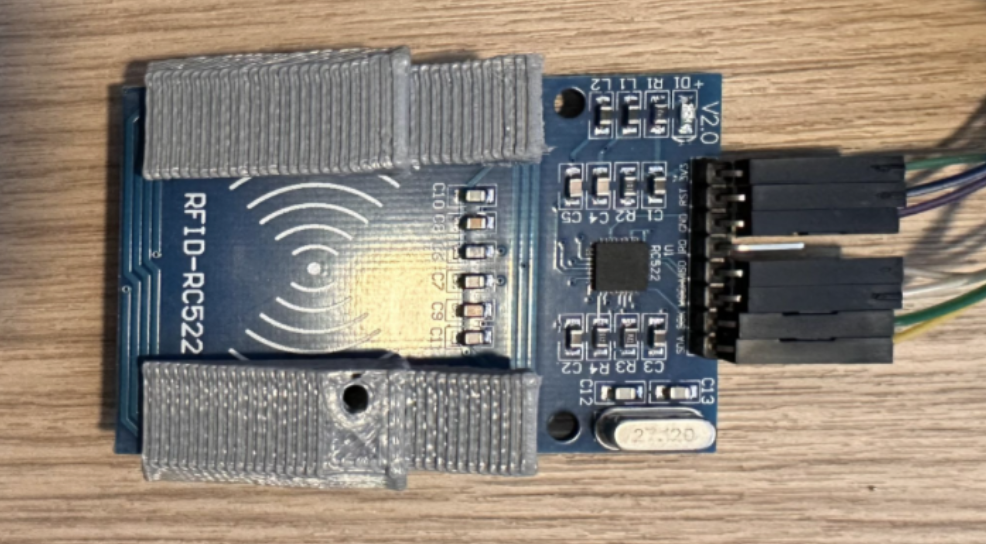

## 2023-10-10

Our objective was to have a complete PCB design by the second round of order deadline. We had been working on finding the correct footprints and components, as well as, creating the schematics on KiCad. I found it difficult routing the wires on the PCB and could not create clean connections. However, Rohan and Krish were able to fix the wiring, so we could submit an order by the deadline. 

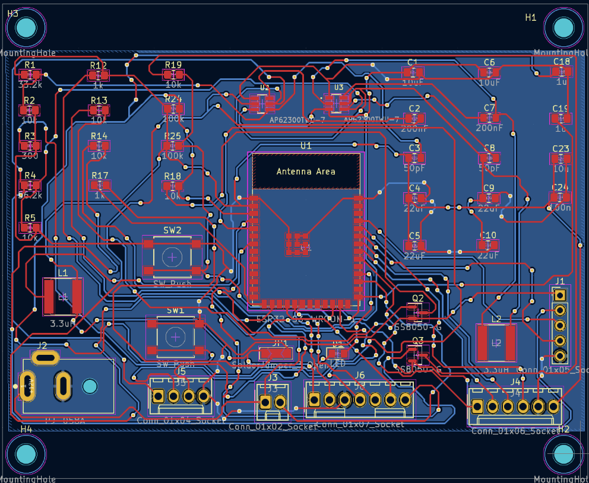

## 2023-10-19

Our objective was to finalize our parts order. We carefully reviewed shortlisted components, weighing factors like technical specifications, cost, and availability. This process led to the selection of the ESP32 microcontroller, RFID reader, camera module, and LCD display, which ensured optimal balance between functionality and budget constraints. Furthermore, we refined the circuit diagrams for the control and power supply subsystems, which integrated the new components' specifications and connection details. Our next step involves delving deeper into communication protocols like SPI and I2C. Particularly, investigating and implementing them to facilitate efficient data exchange between the microcontroller and other components.

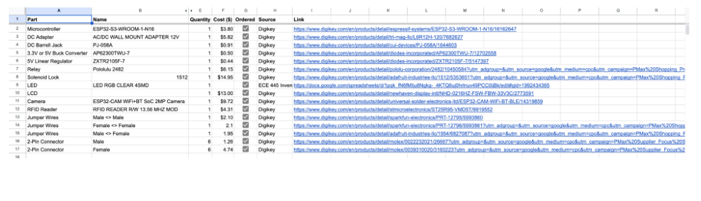

## 2023-10-22

Our objective was to see what converters we would need for our design since our TA had recommended simplifying our power supply subsystem as, for instance, using a battery charger for our system was unnecessary. Hence, I conducted a tolerance analysis on a 12V to 3.3V buck converter, 12V to 5V buck converter, and a 12V to 3.3V linear regulator. Based on the tolerance analysis, both buck converters would produce the necessary power without overheating, but the linear regulator would not. Therefore, we decided to use both buck converters for our design.

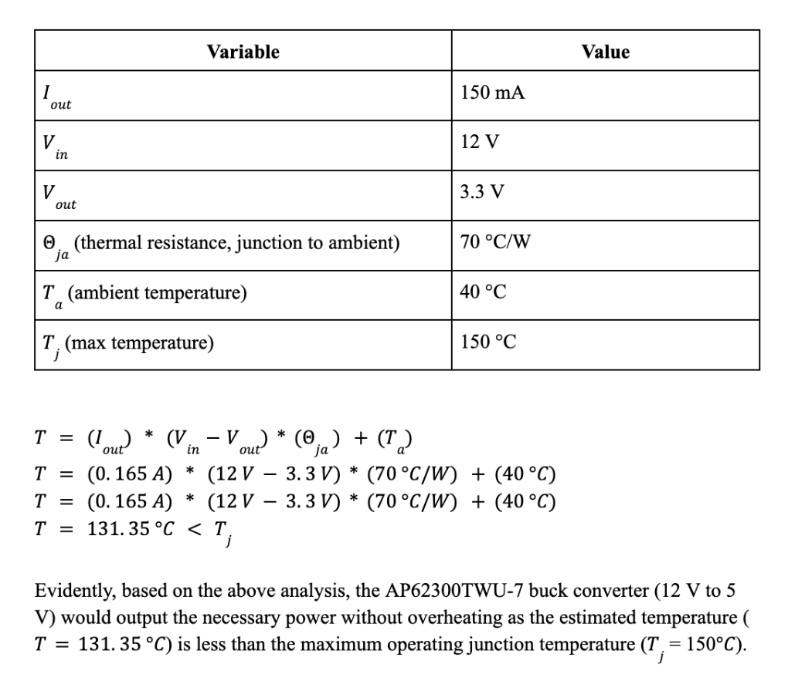

## 2023-11-13

Our objective was to carefully and accurately solder the components we had available onto the PCB. I started to assemble the control subsystem hardware, and soldered each component onto the PCB by following proper soldering techniques and safety precautions. I took extra care to ensure all connections were secure and reliable since I was aware any loose contact could hinder the system's functionality. 

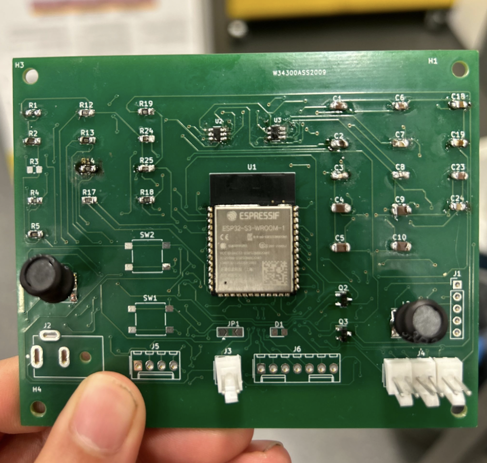

## 2023-11-16

Our objective was to test the basic functionality of the control subsystem to ensure proper operation. After successfully soldering the remaining components, we conducted a series of tests to verify the basic functionality of the control subsystem. We programmed the ESP32 microcontroller, but when we tested our power supply, we noticed abnormal voltage readings which caused overheating issues. We originally designed our power supply to take a 12-volt input and convert it to both 5 volts and 3.3 volts. Unfortunately, during testing, we discovered a problem with one of the circuits. Instead of converting the voltage correctly, it was outputting about 24 volts, causing our circuit board to overheat. With the deadline for our project looming, we had to make a quick decision. We decided to redesign the power supply subsystem to avoid further delays and ensure the safety of our project. 

## 2023-11-18

Our objective was to continue our progress on the software front and focus on refining the user interface for improved clarity and interaction flow. This involved developing software modules for handling user input, displaying information, and navigating through the different functionalities. In addition, we implemented HTTP request functionality to enable data exchange between the ESP32 and Firebase, and to ensure data integrity and accessibility, we created functions for storing and retrieving component data from the Firebase database. Initial testing revealed the successful implementation of HTTP requests, but also showed minor bugs in data storage and retrieval functions that require further debugging. 

## 2023-11-19

Our objective was to resolve the identified bugs in the data storage and retrieval within Firebase, We also implemented techniques like adjusting camera settings and lighting conditions, achieving a significant improvement in QR code scanning accuracy. In addition, we conducted comprehensive system-level testing, encompassing all core functionalities – iCard authorization, container unlocking, QR code scanning, component identification, data storage and retrieval, and user interface interaction. However, while analyzing test results, we identified a minor issue with user interface responsiveness.

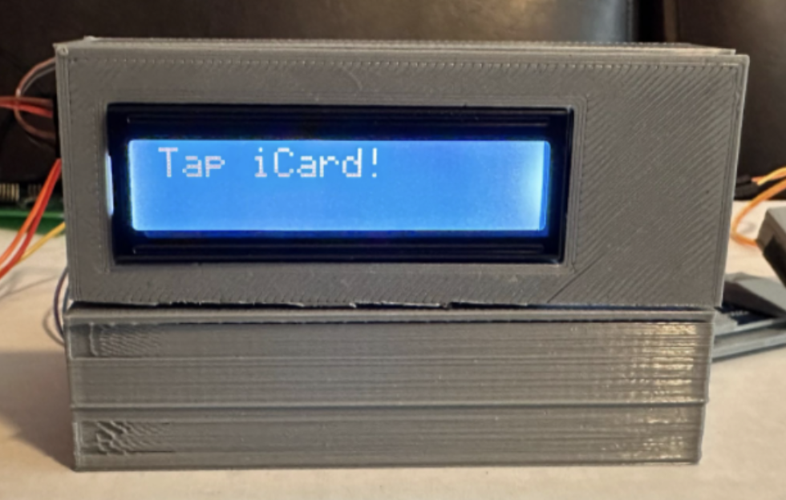

## 2023-11-23 to 2023-11-26

Our objective was to make sure we tested all the functionalities and features of the software side of our system via a breadboard. Fortunately, any remaining issues identified prior during testing were resolved. However, our more major objective, at this time, was to have a working and fully soldered PCB design. We had implemented design changes to our block diagram, specifically our power supply subsystem, and were waiting on our new parts to arrive. Again, during testing, our initial PCB design caused overheating problems and inconsistent voltage readings. Originally, we had designed our power supply subsystem to take a 12-volt input and convert it to both 5 volts and 3.3 volts. Unfortunately, one of the buck converter circuits unexpectedly outputted about 24 volts instead of the intended 3.3 volts, causing the circuit board to overheat. This issue arose from our 12V to 3.3V buck converters not functioning properly. We managed to program the ESP32 microcontroller on the PCB without using the original 12V power supply. Consequently, we lowered our input voltage from 12V to 5V and replaced the faulty 12V to 3.3V buck converters with a 5V to 3.3V linear regulator. Furthermore, this design change required us to separate the PCB into two parts: one handling the power supply subsystem and the other handling the ESP32 microcontroller and other functionalities. This revised design resolved the overheating issues and ensured stable voltage readings, which allowed us to proceed with our project development. Hence, when the parts arrived, we quickly began to solder the PCB and then put all the connections together.

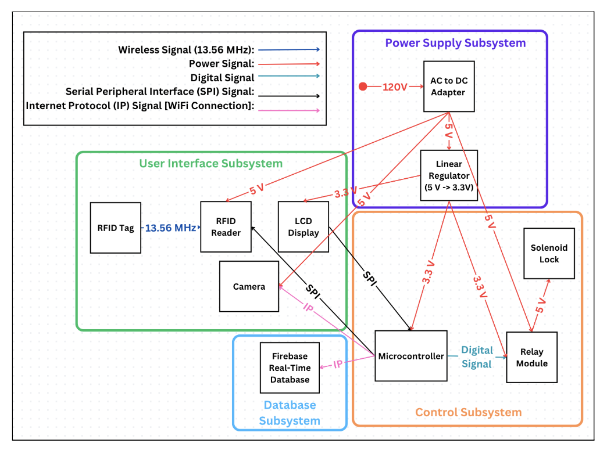

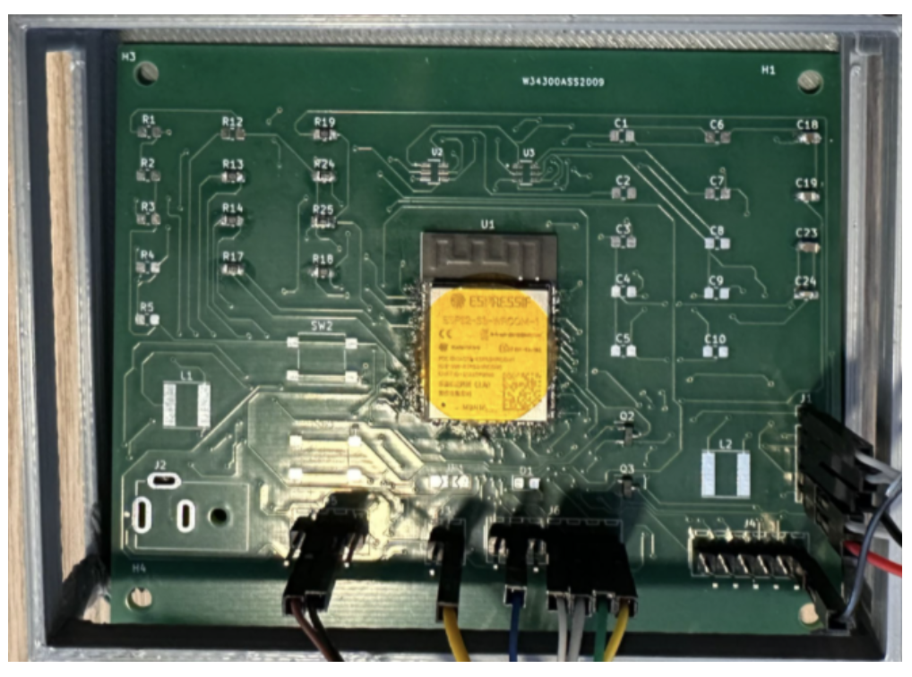

## 2023-11-27

Our objective was to integrate all subsystems into a complete prototype. We assembled the hardware components and connected them according to our design, and then integrated the software modules for control, user interface, and database functionalities. Extensive system-level testing was conducted to verify the complete functionality of each aspect: iCard authorization and container unlocking, QR code scanning and component identification, data storage and retrieval in Firebase, and user interface feedback and interaction. The results were documented, revealing successful integration of all subsystems. However, minor issues with QR code scanning accuracy in low-light conditions were identified, which prompted further optimization of the camera settings.

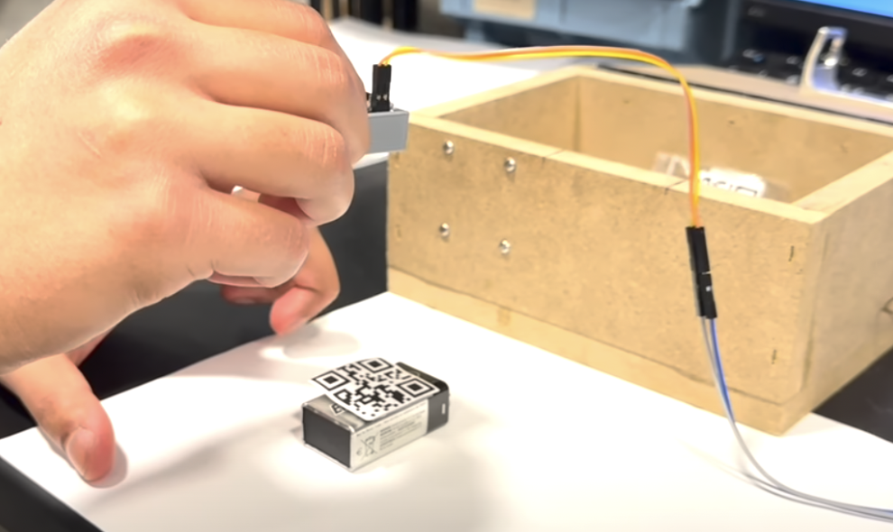

## 2023-11-28 to 2023-12-05

Our objective was to demo and present a working project, and so we demoed and presented our completed automated camera inventory system, showcasing its full functionality to Professor Professor Mironenko, TA Sanjana Pingali, and some of our peers. We demonstrated how our system met the pre-defined requirements and verification criteria. For instance, we securely locked components within a container with a valid iCard tap. the camera scanned QR codes, identifying each component by name, and each scan updated the database and accurately reflected borrowed and returned components for individual student records. Last but not least, we concluded by discussing potential improvements and future work to further enhance our system's capabilities.
